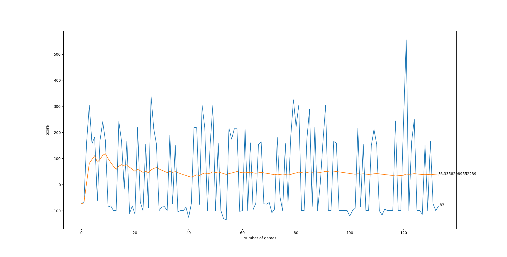
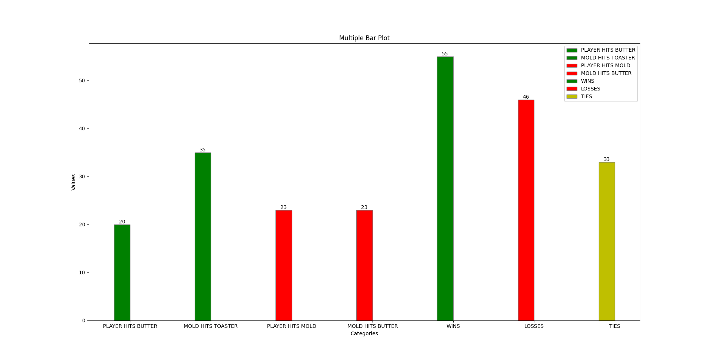

# Maze-RL: Reinforcement Learning Maze Game

Maze-RL is a Python project that combines a custom maze game with a reinforcement learning (RL) agent. The agent learns to navigate a grid-based maze, avoiding obstacles and adversaries, to reach its goal using deep Q-learning. The project features a visual interface, dynamic reward system, and training visualizations.

## Features
- **Custom Maze Environment:** Grid-based maze with barriers, a player, a mold adversary, a toaster, and a butter goal.
- **Deep Q-Learning Agent:** Uses a neural network to learn optimal actions via experience replay.
- **Dynamic Rewards:** Rewards and penalties for exploration, reaching goals, and avoiding dangers.
- **Visualizations:** Real-time training progress and win/loss statistics using matplotlib.
- **Pygame Interface:** Visual feedback for game state and agent actions.

## How It Works
The project consists of two main components:

1. **Maze Game (`game_train.py`, `game_simulator.py`):**
	- Implements the maze logic, player and adversary movement, and reward system.
	- Uses Pygame for rendering the maze and entities.
	- Supports both human and agent play.

2. **RL Agent (`agent.py`, `model.py`):**
	- The agent observes the game state and selects actions using an epsilon-greedy policy.
	- Experiences are stored in replay memory and used to train a neural network (Q-learning).
	- The model is trained to maximize cumulative rewards by learning from both short- and long-term memory.

## Installation
1. **Clone the repository:**
   ```sh
   git clone https://github.com/PedroGF45/maze-rl.git
   cd maze-rl
   ```
2. **Install dependencies:**
   - Python 3.8+
   - [PyTorch](https://pytorch.org/)
   - [Pygame](https://www.pygame.org/)
   - [matplotlib](https://matplotlib.org/)
   - [numpy](https://numpy.org/)
   - (Optional) [IPython] for display in notebooks
   
   Install with pip:
   ```sh
   pip install torch pygame matplotlib numpy ipython
   ```

## Usage
To train the RL agent in the maze environment:

```sh
python agent.py
```

This will launch the training loop, display the Pygame window, and plot training statistics. The trained model is saved to `model/model.pth`.

To play or simulate the maze manually, you can run:
```sh
python game_simulator.py
```

## Project Structure

```
maze-rl/
├── agent.py           # RL agent and training loop
├── game_train.py      # Maze game logic for RL
├── game_simulator.py  # Manual/visual simulation
├── model.py           # Neural network and trainer
├── helper.py          # Plotting utilities
├── model/
│   └── model.pth      # Saved model weights
├── README.md
└── ...
```


## Visualizations & Examples
During training, two plots are generated and saved:
- `plot_reward.png`: Shows the agent's score and mean score over time.
- `plot_bar.png`: Displays win/loss/tie statistics.

### Example Screenshots

#### 1. Training Progress (Score and Mean Score)


#### 2. Win/Loss/Tie Statistics


#### 3. Maze Game State (Pygame Window)


#### 4. Sample Training Output (Console)


## Contributing
Contributions are welcome! Please open issues or submit pull requests for improvements or bug fixes.

## License
This project is licensed under the MIT License.
